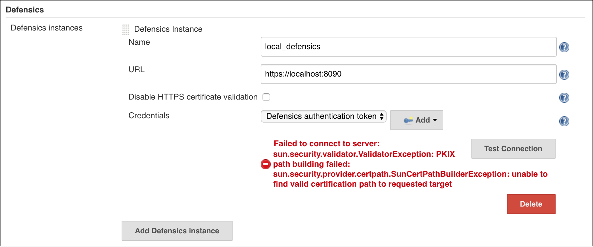

# FAQ

## How do I start the Defensics API Server?

See [Using Defensics API Server](defensics-api-server.md).

## I get an error "unable to find valid certification path to requested target", how do I fix it?

This means your Defensics is using a certificate Jenkins doesn't trust, 
for example, a self-signed certificate. For instructions on how to make Jenkins 
trust your certificate, see 
[CloudBees documentation](https://support.cloudbees.com/hc/en-us/articles/203821254-How-to-install-a-new-SSL-certificate-). 
As a workaround, you can select the **Disable HTTPS certificate validation** 
check box, but that is not recommended as a permanent solution for security 
reasons.

## Where can I get a .set file?
The suite and tests can be configured in Defensics. To save it as a `.set` file, 
select **File > Save Settings**. One `.set` file contains the test settings for 
one test suite.

## How do I get my .set file into my job's workspace?
It depends on where the `.set` file is kept. If it's in a version control 
system, the repository can be cloned into your workspace by configuring the VCS 
for the job. If it's in Artifactory, a network drive, or other similar location 
reachable from Jenkins, a step can be added before the fuzzing step to copy the 
`.set` file to the workspace.

## How should I override test configuration file settings?
You can override settings from the test configuration file using the Defensics 
CLI setting format. The format is **--key value**, where:
- **value** should have double quotes around it, if it contains spaces.
- some settings use only **key** and no **value**.
- you can add as many settings as needed, separated by spaces.

The available settings depend on the test suite in use. To find out more, see 
Defensics CLI help by using a machine where Defensics is installed and running:

`java -jar /opt/synopsys/defensics/monitor/boot.jar --full-help`

## Why did my fuzzing step fail?

If a fuzzing step failed, it's important to first distinguish between whether 
the test results contained failures, or whether running the tests themselves 
failed.

If the build status page contains links to Defensics Results, then fuzzing 
succeeded, but the tests found problems in your test target's operation. To see 
details on what tests failed, open the result report (the **Defensics Results** 
link).

If the build status page does not contain links to **Defensics Results**, there 
was a problem with running the tests. Open **Console Output** for the build and 
look for the lines that start with \[Defensics\] for errors.

For more information about both kinds of failures, see Defensics documentation.

## How can I get more help?
To get more help, contact Synopsys Software Integrity support: 
https://www.synopsys.com/software-integrity/support.html.