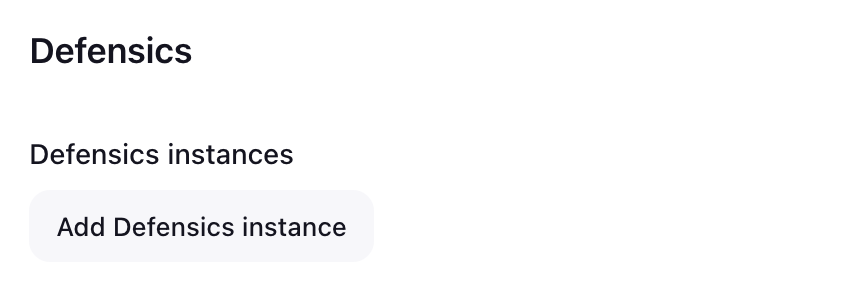
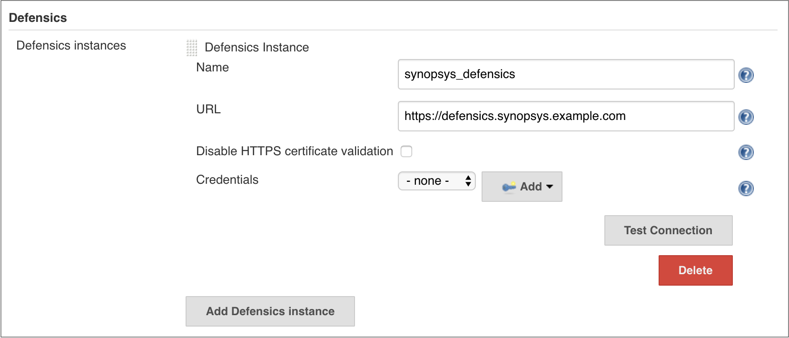
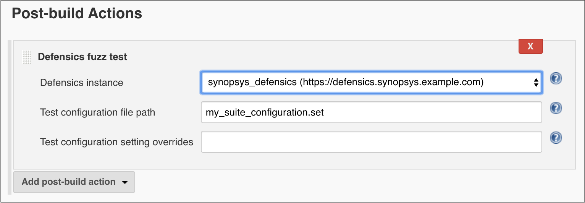
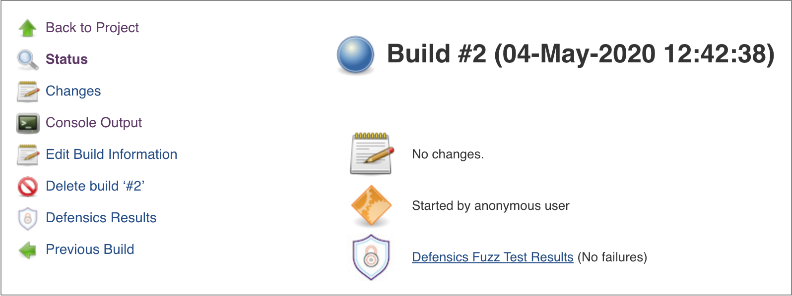
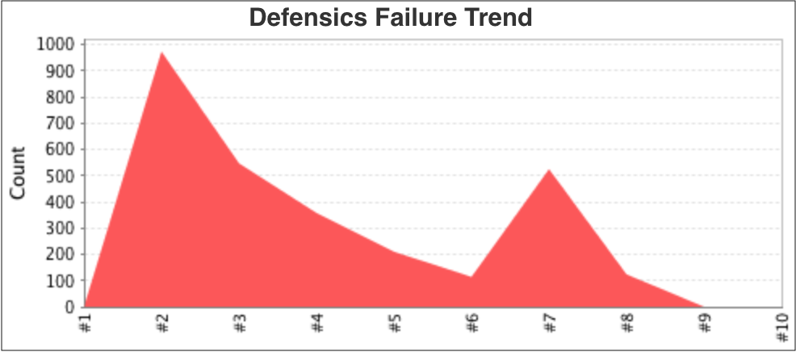

# Defensics Jenkins plugin user guide

## Overview

The Black Duck Defensics Jenkins plugin enables you to integrate Defensics fuzz
testing into your Jenkins builds. It allows you to connect to multiple Defensics 
instances and run pre-configured fuzz tests on them.

More information on Defensics and fuzz testing is available at 
https://www.blackduck.com/fuzz-testing.html.
 
## Requirements

Requirements for the Defensics Jenkins plugin are:
- Jenkins 2.375.4 or later. Non-LTS versions of Jenkins are not supported.
- Defensics 2023.6.0 or later.

The Defensics Jenkins plugin uses the following plugins, which will be installed 
by Jenkins on Defensics plugin installation, if not already installed:
- [Credentials plugin](https://plugins.jenkins.io/credentials/) for storing 
Defensics credentials. 1224.vc23ca_a_9a_2cb_0 is the minimum supported version.
- [Plain Credentials plugin](https://plugins.jenkins.io/plain-credentials/) for storing
Defensics credentials. 143.v1b_df8b_d3b_e48 is the minimum supported version.
- [HTML Publisher plugin](https://plugins.jenkins.io/htmlpublisher/) for 
publishing Defensics HTML result reports. 1.31 is the minimum supported version.

## Downloading and installing the Defensics Jenkins plugin

To install the plugin:
1. In Jenkins, select **Manage Jenkins > Manage Plugins**.
2. Go to the **Available** tab.
3. Select the checkbox for **Defensics plugin**.  Note that if the plugin is 
already installed on your system, you will not see it listed on the 
**Available** tab.
4. Select **Download now and install after restart** to install the plugin 
after the next Jenkins restart.
5. After restarting Jenkins, confirm that the plugin is successfully installed 
by navigating to **Manage Jenkins > Manage Plugins > Installed**, and verify 
that **Defensics plugin** shows in the list.

## Updating the Defensics Jenkins plugin

You can update the plugin as new versions are released.

To update the plugin:
1. In Jenkins, select **Manage Jenkins > Manage Plugins**.
2. Go to the **Updates** tab.
3. Select **Defensics plugin**.
    * If there are updates for the **Defensics plugin**, the updates show in 
the list.
    * Alternatively, you can force Jenkins to check for plugin updates by 
selecting **Check now**, and then look for an update in the list.
4. If there are updates, select the one you want, then select **Download now 
and install after restart** to install the plugin after the next Jenkins restart.

## Configuring the Defensics Jenkins plugin

Use the following process to configure the plugin.

### Global configuration

Defensics Jenkins plugin supports connecting to multiple Defensics instances. 
To add connections, use the following process.

1. After installing, select **Dashboard > Manage Jenkins > Configure System > 
Defensics**.
   
2. In the **Defensics** section, select **Add Defensics Instance** and complete 
the following fields.
    * **Name**: Give a name for your Defensics instance. The name is used to 
help identify instances if there are more than one.
    * **URL**: The URL for your Defensics instance.
    * **Credentials**: Your authentication token for authenticating with your 
Defensics instance. In the **Credentials** drop-down list box, select correct 
credentials.  Selecting **Add** enables you to add encrypted credentials. Add 
your authentication token as credential of kind **Secret text**.
    
3. Select **Test Connection** to verify that your settings are correct.  If the 
connection is valid, a confirmation message of *Success* is shown.
    * [How do I start the Defensics API Server?](https://github.com/jenkinsci/defensics-plugin/blob/master/doc/faq.md#how-do-i-start-the-defensics-api-server)
    * [I get an error "unable to find valid certification path to requested target", how do I fix it?](https://github.com/jenkinsci/defensics-plugin/blob/master/doc/faq.md#i-get-an-error-unable-to-find-valid-certification-path-to-requested-target-how-do-i-fix-it)
4. Select **Save**.

### Deleting connections

To delete a Defensics instance, use the following process.
1. Select **Dashboard > Manage Jenkins > Configure System > Defensics**.
2. In the **Defensics** section, locate the instance to delete and select 
**Delete** below the connection to delete.  Proceed with caution, as there is no 
confirmation message at this point.

### Configuring Defensics test steps for freestyle projects

You can integrate Defensics fuzz tests into your builds as a build or post-build 
step in your freestyle jobs. There can be one Defensics post-build step and as 
many Defensics build steps as needed, for example, to test with different test 
suites. In this example we configure a post-build step, but configuring a build 
step has the same options.

1. With a job selected, select **Configure > Post-build Actions**.
2. In the **Add post-build action** drop-down list box, select **Defensics fuzz 
test**.
   
3. Select the Defensics instance to use. By default, the first instance in the 
list is selected.
4. Set the **Test configuration file path** to use for testing. The path is 
relative to the project's workspace. 
    * [Where can I get a .set file?](https://github.com/jenkinsci/defensics-plugin/blob/master/doc/faq.md#where-can-i-get-a-set-file)
    * [How do I get my .set file into my job's workspace?](https://github.com/jenkinsci/defensics-plugin/blob/master/doc/faq.md#how-do-i-get-my-set-file-into-my-jobs-workspace)
5. If you want to override any settings from the test configuration file, you 
can do so in the **Test configuration setting overrides** text box.
    * [How should I override test configuration file settings?](https://github.com/jenkinsci/defensics-plugin/blob/master/doc/faq.md#how-should-i-override-test-configuration-file-settings)
6. If you want Defensics result package zip files to be saved with each build, 
check the **Save Defensics result package for builds** checkbox. The files are 
quite big and storing many of them will take up disk space, so this is disabled 
by default. A result package can be imported into Defensics UI to re-run the 
tests.
7. Select **Save**.

### Configuring Defensics test steps for pipeline projects
The minimum syntax for running fuzz tests in a pipeline script is:

`defensics configurationFilePath: 'my_suite_configuration.set'`

The full syntax is:

`defensics configurationFilePath: 'my_suite_configuration.set', 
configurationOverrides: '--uri https://example.com', defensicsInstance: 
'my_defensics_instance', saveResultPackage: true`

The parameters are explained above in Configuring Defensics test steps for freestyle 
projects.

**defensicsInstance** is optional, and when it's not specified, the first 
configured instance is used. It's recommended not to leave it out if there are 
more than one Defensics instances configured in Jenkins.

**configurationOverrides** is optional, and when it's not specified, all the 
test configuration settings come from the **Test configuration file**.

## Results

### Build results

The build status page contains links to the fuzzing report in both the sidebar 
menu and the main content area. The number of failures is also visible in the 
main content area. If you don't see links to the report, it means a fuzzing step 
was not completed for that build. If there are multiple fuzzing steps, reports 
for all of them are found behind the same link. The reports are separated into 
tabs.

There will also be a link to the result package for each Defensics step in the 
build that has **Save Defensics result package for builds** enabled.

### Project results

Once there are at least two builds with Defensics results, the Defensics Failure 
Trend chart appears on the project status page.

The project status page sidebar menu also contains a link to the latest build's 
Defensics Results report, if the latest build has one.

## Frequently asked questions

[FAQ](https://github.com/jenkinsci/defensics-plugin/blob/master/doc/faq.md)
